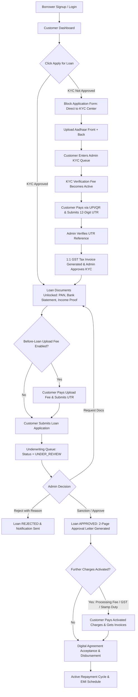
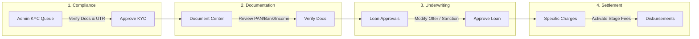

# Loan Approve — Enterprise Fintech Loan Management & Operations Platform

[](https://www.typescriptlang.org/)
[](https://react.dev/)
[](https://vitejs.dev/)
[](https://tailwindcss.com/)
[](https://nodejs.org/)
[](https://expressjs.com/)
[](https://www.prisma.io/)
[](https://www.sqlite.org/)
[](https://vitest.dev/)

Loan Approve is a production-grade, full-stack fintech loan origination, compliance underwriting, and customer lifecycle management platform. The system bridges mobile-first borrower onboarding with an administrative back-office command center, enforcing strict regulatory KYC gating, stage-aware fee settlements, 1:1 idempotent GST tax invoice generation, 2-page sanctioned approval letter rendering, server-to-server bulk WhatsApp/Email communications, and immutable audit logging.

---

## Table of Contents

1. [Project Overview](#1-project-overview)
2. [Main Features](#2-main-features)
   - [Customer Portal](#customer-portal)
   - [Admin Command Center](#admin-command-center)
3. [Complete Customer Workflow](#3-complete-customer-workflow)
4. [Admin Operations Workflow](#4-admin-operations-workflow)
5. [Communication System](#5-communication-system)
   - [WhatsApp Integration (WA Bridge S2S)](#whatsapp-integration-wa-bridge-s2s)
   - [Email Integration (SMTP)](#email-integration-smtp)
   - [Communication Selection Architecture](#communication-selection-architecture)
6. [Customer Account Soft Deactivation & Reactivation](#6-customer-account-soft-deactivation--reactivation)
7. [Typography & Design System](#7-typography--design-system)
8. [Technology Stack](#8-technology-stack)
9. [Project Structure](#9-project-structure)
10. [Environment Variables](#10-environment-variables)
11. [Installation & Setup](#11-installation--setup)
12. [Testing & Quality Verification](#12-testing--quality-verification)
13. [Production Configuration](#13-production-configuration)
14. [Security & Compliance](#14-security--compliance)
15. [PDF & Document Generation Engine](#15-pdf--document-generation-engine)

---

## 1. Project Overview

Digital lending platforms require strict operational compliance, identity verification, fraud prevention, and deterministic state transitions. **Loan Approve** solves these core challenges through:

1. **Deterministic Stage Gating**: Borrowers cannot leapfrog stages. Identity verification (Aadhaar Front & Back) and administrative KYC approval are mandatory prerequisites before loan applications, supplementary documents, or post-approval fees can be accessed.
2. **Real-Time Data Synchronization**: Active polling synchronization (1500ms intervals) ensures instant queue updates across KYC reviews, payment verification, underwriting decisions, and borrower status screens without page reloads.
3. **Audit & Compliance Preservation**: Financial ledgers, verified UTRs, tax invoices, and identity records are immutable. Customer accounts support administrative soft-deactivation (login blocking) while preserving 100% of historical loan records for regulatory reporting.
4. **Whitelabel Multi-Tenant Branding**: Dynamic branding configuration (company name, logo, primary color tokens, watermarks, digital seals, and custom domains) loaded dynamically at runtime across the web application and generated PDF documents.

---

## 2. Main Features

### Customer Portal
A mobile-first, responsive borrower workspace designed for frictionless self-service:

* **Authentication & Onboarding**: Passwordless, mobile-based login with 10-digit validation, state/city cascading, and HMAC-SHA256 zero-knowledge Aadhaar deduplication.
* **Identity KYC Center (`/customer/kyc`)**: Mandatory upload of both Aadhaar Front and Aadhaar Back documents (PDF, JPG, PNG up to 10MB) with preview and re-upload versioning.
* **Stage-Aware Payments (`/customer/payments`)**: Dynamic fee ledger displaying currently active fees only (KYC verification fee, optional document upload fee, processing charges) with UPI QR codes and bank details.
* **12-Digit UTR Submission**: Direct submission of transaction reference numbers with automated duplicate prevention and live verification status tracking (`NOT_PAID` → `UNDER_VERIFICATION` → `PAID`).
* **1:1 GST Tax Invoices**: Automated generation and download of official, immutable PDF tax invoices with dynamic 18% GST tax breakdowns upon payment verification.
* **Loan Application Gate (`/customer/apply`)**: Strict identity prerequisite gate (`NO APPROVED KYC = NO LOAN`) preventing premature loan submissions.
* **Loan Documents Checklist (`/customer/documents`)**: 4-tier document center (PAN Card, Bank Statement, Income Proof, Supplementary Docs) with progressive completion counter (`0/4` → `4/4`) and version archiving.
* **Borrower Journey Timeline (`/customer/dashboard`)**: Visual progress indicators, active loan parameters (sanctioned amount, interest rate, tenure, estimated EMI), greeting cards, and quick actions.
* **Official Loan Approval Letter**: Immediate view and download of the official 2-Page Loan Approval Letter PDF upon sanction.
* **Support Desk (`/customer/support`)**: Integrated ticketing system for customer inquiries and administrative responses.
* **In-App Notification Center**: Real-time notification feed tracking all critical loan lifecycle milestones.

### Admin Command Center
A comprehensive operations suite for compliance officers, underwriters, and administrators:

* **Executive Dashboard (`/admin/dashboard`)**: 12 real-time KPI metrics, visual customer conversion funnel, application trend charts, and live activity tracking table.
* **Borrower Directory (`/admin/customers`)**: Complete borrower registry with search, date presets (Today, Yesterday, Last 7 Days, Last 30 Days, Custom Range), state filter, status tabs (All, Pending Approval, Active, Deactivated), and unpaginated multi-selection.
* **Customer 360 Workspace (`/admin/customers/:id`)**: 7-tab deep-dive explorer covering Overview, KYC Verification, Uploaded Documents, Payment Ledger, EMI Schedule, Granular Charges, and Chronological Audit Trail.
* **Immediate KYC Queue (`/admin/kyc`)**: Instant queue visibility for all customers who have uploaded Aadhaar documents without requiring upfront fee payment for queue entry. Includes document review modal and explicit KYC approval actions.
* **Document Management Center (`/admin/documents`)**: Categorized document archives (KYC, Approval Letters, Invoices, Agreements) with secure authenticated streaming and bulk ZIP downloads.
* **Loan Approval Operations (`/admin/loan-approval`, `/admin/loans`)**: Dedicated underwriting hub with tabbed state management (`Pending`, `Approved`, `Rejected`), auto-calculated EMI schedules, manual amount/tenure overrides, and mandatory decline reasons.
* **Pending Approval Queue (`/admin/customers?status=PENDING_APPROVAL`)**: Real-time queue of borrowers awaiting underwriting with row selection checkboxes and **"Select All Pending ({N})"** bulk messaging triggers.
* **Payment Management & UTR Verification (`/admin/payments`)**: Central transaction registry for inspecting submitted UTRs, approving payments, triggering automatic tax invoice generation, and detecting duplicate transaction claims.
* **Granular Charges Engine (`/admin/charges`)**: Management of global charges (KYC fee, Processing deposit, Interest rates), customer-specific stage fees (GST, Stamp Duty, TDS, Insurance, Late Fee), and the toggleable Before-Loan "Loan Document Upload Fee".
* **Communication Center (`/admin/whatsapp`, `/admin/email`)**: S2S configuration for official WA Bridge API and SMTP email relays, alongside direct inline customer selection and message composition modals.
* **Branding & Document Customizer (`/admin/settings/branding`, `/admin/settings/document-branding`)**: Whitelabel brand editor managing logos, watermarks, digital certificate seals, color palettes, and multi-tenant domain bindings.
* **Audit Trail (`/admin/audit-logs`)**: Immutable compliance log recording every administrative action, customer status change, payment verification, and communication dispatch with timestamps, actor IDs, and IP addresses.

---

## 3. Complete Customer Workflow

The following state diagram illustrates the mandatory sequential lifecycle enforced across the platform:



### Stage Gating Matrix

| Stage | Trigger / Precondition | Visible Charges | Unlocked Actions |
|:---:|---|---|---|
| **Stage 0** | Account Registered; Aadhaar not uploaded | None (*"No payment is currently required"*) | Aadhaar Front + Back Upload |
| **Stage 1** | Aadhaar Front + Back uploaded | **KYC Verification Fee** (Active) | UPI / QR Pay + Submit UTR |
| **Stage 2** | 12-Digit UTR submitted | KYC Verification Fee (`UNDER_VERIFICATION`) | Awaiting Admin Verification |
| **Stage 3** | Admin verifies UTR reference | KYC Verification Fee (`PAID`) | Download GST Tax Invoice |
| **Stage 4** | Admin explicitly approves KYC | KYC Fee (`PAID`) | Loan Documents Center Unlocked |
| **Stage 5** | PAN, Bank, Income docs uploaded | **Document Upload Fee** (*Only if Admin enabled*) | Submit Loan Application |
| **Stage 6** | Application Submitted | None | Underwriting Review |
| **Stage 7** | Admin approves / sanctions loan | **Processing Fee, GST, Stamp Duty** (*If activated*) | Download 2-Page Approval Letter |
| **Stage 8** | Digital Agreement Signed | None | Fund Disbursement (Bank/UPI) |
| **Stage 9** | Disbursement Recorded | None | Monthly EMI Repayment Tracking |

> [!IMPORTANT]
> **Core Architectural Rule: `NO APPROVED KYC = NO LOAN APPLICATION`**  
> The backend REST API explicitly rejects loan application creation (`403 KYC_REQUIRED`) until the customer's KYC status is marked `APPROVED` / `VERIFIED` by an administrator.

---

## 4. Admin Operations Workflow

Administrators manage borrower progression through dedicated operational consoles:



1. **KYC Verification (`/admin/kyc`)**: Inspect uploaded Aadhaar images, verify submitted UTR against bank records, and click **Approve KYC**.
2. **Document Management (`/admin/documents`, `/admin/customers/:id`)**: Inspect PAN, Bank Statements, and Income slips. Request re-uploads or verify individual files.
3. **Underwriting Console (`/admin/loan-approval`, `/admin/loans`)**: Review borrower income vs requested amount. Adjust proposed amount or tenure, calculate dynamic EMIs, and issue loan sanction.
4. **Charges Activation (`/admin/charges`, `/admin/customers/:id`)**: Select specific loan charges (Processing Fee, GST, Stamp Duty) and dispatch them to the borrower's fee ledger.
5. **Disbursement Recording (`/admin/disbursements`)**: Record fund transfers (NEFT/RTGS/IMPS/UPI) with reference IDs and trigger customer disbursement notifications.

---

## 5. Communication System

The communication subsystem decouples **Gateway Provider Configuration** from **Customer Selection and Message Dispatching**.

### WhatsApp Integration (WA Bridge S2S)

```
┌────────────────────────────────────────────────────────┐
│ Admin → Settings → WhatsApp (Provider Config Only)     │
│  • API Base URL: https://web.wabridge.com/api          │
│  • Send Message Endpoint: /sendmessage                 │
│  • Auth Header: x-access-token (Masked Key)            │
│  • Device ID / WABA ID / Phone ID                      │
└────────────────────────────────────────────────────────┘
                           │
                           ▼
┌────────────────────────────────────────────────────────┐
│ Admin → All Customers / Pending Approval Queue         │
│  • Select Rows or Click [Select All Pending (14)]      │
│  • Floating Action Bar → Click [Send WhatsApp]         │
│  • Direct Inline Composer Modal Opens (No Navigation)  │
│  • Draft Message with {{customerName}}, {{loanAmount}} │
│  • Click [Send WhatsApp] → S2S Dispatch via WA Bridge  │
│  • Campaign Results Summary Modal (Sent / Failed logs) │
│  • Selection Automatically Cleared                     │
└────────────────────────────────────────────────────────┘
```

* **Provider Configuration (`/admin/settings/whatsapp`, `/admin/whatsapp`)**:
  - API Base URL (e.g., `https://web.wabridge.com/api`)
  - Send Message Endpoint (e.g., `/sendmessage` or `/v1/send`)
  - Authentication Header Name (`x-access-token`)
  - API Key / Token (stored securely with AES-256-GCM encryption)
  - Device Identifier, WABA ID, Phone ID, Sender Number
  - *Honest Health Check*: Reports `CONFIGURED` when official validation health endpoints are pending.
* **Customer Selection & Inline Dispatch (`/admin/customers`)**:
  - Selection checkboxes per customer row.
  - Header checkbox selects visible rows on the active page.
  - **"Select All Matching ({N})" / "Select All Pending ({N})"**: Queries `GET /api/admin/customers/all-matching` to resolve all matching customer IDs across pagination.
  - **Inline WhatsApp Composer Modal**: Opens directly on `/admin/customers` with **zero navigation**. Shows recipient count and recipient name chips.
  - Dynamic variable helper tags: `{{customerName}}`, `{{applicationId}}`, `{{loanAmount}}`, `{{loanStatus}}`, `{{companyName}}`.
  - Backend resolves phone numbers from DB, skips deactivated accounts, formats template variables, and dispatches via WA Bridge.
  - **Campaign Results Summary Modal**: Displays Total Dispatched, Successful Deliveries, and Failures with per-recipient error diagnostics.

### Email Integration (SMTP)

* **SMTP Configuration (`/admin/settings/email`, `/admin/email`)**:
  - SMTP Host, Port (e.g. 587 / 465)
  - Encryption Mode (`TLS`, `SSL`, `STARTTLS`)
  - SMTP Username and Password (encrypted at rest)
  - From Name, From Email, Reply-To Email
* **Customer Selection & Inline Dispatch (`/admin/customers`)**:
  - Select customers from table or click **Select All Pending**.
  - Click **[Send Email]** on the sticky floating bar.
  - **Inline Email Composer Modal**: Opens directly on `/admin/customers`.
  - Input Email Subject and multiline Message Body with dynamic variable chips.
  - Dispatches through saved SMTP transport and presents real-time delivery summary.

### Communication Selection Architecture

```text
/admin/customers (Filter: Pending Approval)
        ↓
Check individual rows OR Click "Select All Pending (14)"
        ↓
Backend resolves all 14 Customer UUIDs via GET /api/admin/customers/all-matching
        ↓
Sticky Floating Bar: "14 Customers Selected" | [Send WhatsApp] [Send Email] [Clear]
        ↓
Click [Send WhatsApp] / [Send Email]
        ↓
Inline Modal Opens (No page reload or navigation)
        ↓
Admin drafts custom message using variable helper chips
        ↓
Click [Send] → Backend resolves DB records → Excludes deactivated accounts → S2S Provider Call
        ↓
Campaign Results Summary Modal Displays (Total: 14 | Sent: N | Failed: M | Error Breakdown)
        ↓
On Dismiss, Active Selection is Automatically Cleared
```

---

## 6. Customer Account Soft Deactivation & Reactivation

To satisfy regulatory and compliance requirements, customer accounts cannot be hard-deleted or cascaded. Instead, a strict **Soft Deactivation** architecture is implemented:

```
┌─────────────────────────────────────────────────────────────────┐
│ Admin Actions: [Deactivate Account] / [Reactivate Account]     │
├─────────────────────────────────────────────────────────────────┤
│ 1. Deactivation:                                                │
│    • Sets status = 'DEACTIVATED', isActive = false              │
│    • Sets deletedAt = timestamp                                 │
│    • Blocks Customer Login & JWT Validation (HTTP 403)          │
│    • Excludes account from bulk WhatsApp & Email dispatches     │
│    • Preserves 100% of loans, KYC docs, payments, and invoices │
│    • Records immutable audit log: CUSTOMER_ACCOUNT_DEACTIVATED  │
│                                                                 │
│ 2. Reactivation:                                                │
│    • Sets status = 'ACTIVE', isActive = true, deletedAt = null  │
│    • Restores customer portal access and active communications  │
│    • Records immutable audit log: CUSTOMER_ACCOUNT_REACTIVATED  │
│                                                                 │
│ 3. Security Boundary:                                           │
│    • Admin-only permission: requirePermission('customers.edit') │
│    • No delete account option exists in Customer Portal         │
└─────────────────────────────────────────────────────────────────┘
```

---

## 7. Typography & Design System

The application implements a structured typography hierarchy and curated color palette across all interfaces to guarantee optimal readability:

### Typography Hierarchy Tokens

| Element | Font Weight | CSS Class | Color Token | Purpose |
|---|:---:|---|---|---|
| **Page Headings (`h1`, `h2`)** | `700` | `font-bold` | `#0F172A` (Deep Slate) | Top-level view titles |
| **Section Headings (`h3`, `thead th`)** | `650–700` | `font-bold` | `#1E293B` (Slate 800) | Card titles, table header columns |
| **Form Labels (`Label`, `label`)** | `600` | `font-semibold` | `#1E293B` (Slate 800) | Form input labels |
| **Form Inputs (`Input`, `Textarea`)** | `500` | `font-medium` | `#0F172A` (Text), `#94A3B8` (Placeholder) | User entered text |
| **Primary Values & Financials** | `600–700` | `font-semibold` / `font-bold` | `#0F172A` / `#2563EB` | Rupee amounts, UTRs, loan IDs |
| **Secondary Metadata & Timestamps** | `450–500` | `font-medium` | `#475569` / `#64748B` | Subtitles, helper text, dates |
| **Badges & Action Buttons** | `600–700` | `font-semibold` / `font-bold` | Contrast matched | Status indicators, CTAs |

### Core Design Principles
* **Color System**: Light Blue / Slate / White palette (`#F8FAFC` canvas, `#FFFFFF` cards, `#D6E4F5` / `#CBDDE9` crisp borders, `#2563EB` primary blue).
* **Status Accents**:
  - `Emerald` (`#059669`): Verified KYC, Paid Invoices, Active Accounts, Successful Delivery.
  - `Amber` (`#D97706`): Pending Approvals, In-Review States, Upcoming Due Dates.
  - `Blue` (`#2563EB`): Underwriting In-Review, Active Portals, Sanction Letters.
  - `Rose` (`#E11D48`): Deactivated Accounts, Rejected Loans, Failed Deliveries.
* **Component Primitives**: Standardized via shadcn/ui (`Card`, `Button`, `Dialog`, `Badge`, `Input`, `Textarea`, `Tabs`, `Table`).

---

## 8. Technology Stack

### Frontend Client (`client/package.json`)
* **Core Framework**: React `18.3.1` + Vite `6.0.5` + TypeScript `5.7.2`
* **Styling & UI**: Tailwind CSS `3.4.17` + shadcn/ui + Lucide React `0.469.0` + clsx + tailwind-merge
* **State & Data Fetching**: TanStack Query (React Query) `5.62.8`
* **Routing**: React Router DOM `7.1.1`
* **Forms & Schema Validation**: React Hook Form `7.54.2` + Zod `3.24.1` + `@hookform/resolvers`
* **Charts & Metrics**: Recharts `2.15.0`
* **Testing Suite**: Vitest `2.1.8` + Testing Library React `16.1.0` + JSDOM `25.0.1`

### Backend Server (`server/package.json`)
* **Runtime & Framework**: Node.js `20+` + Express `4.21.2` + TypeScript `5.7.2`
* **Database & ORM**: SQLite (WAL Mode) + Prisma ORM `6.1.0`
* **Authentication & Security**: JSON Web Tokens (`jsonwebtoken` `9.0.2`) + `bcryptjs` `2.4.3` + `helmet` `8.0.0` + `express-rate-limit` `7.5.0`
* **PDF & Media Generation**: `pdfkit` `0.20.2` + `qrcode` `1.5.4` + `archiver` `8.0.0` + `multer` `2.4.0`
* **Communication Providers**: `nodemailer` `10.0.10` (SMTP & Ethereal) + WA Bridge HTTP Client
* **Testing Suite**: Vitest `2.1.8` + Supertest `7.0.0`

---

## 9. Project Structure

```text
Loan-Approve/
├── client/                          # React + Vite Frontend
│   ├── src/
│   │   ├── __tests__/               # 13 Vitest UI & Integration Test Suites (75 Tests)
│   │   ├── api/                     # Axios/Fetch API client & typed endpoints
│   │   ├── components/              # Reusable UI primitives & operational components
│   │   │   ├── admin/               # Document viewers, charges sections, KYC modals
│   │   │   ├── customer/            # Loan application forms, KYC checklists
│   │   │   └── ui/                  # shadcn/ui components (Button, Dialog, Badge, Textarea, Table)
│   │   ├── contexts/                # AuthContext, BrandingContext
│   │   ├── layouts/                 # CustomerLayout (mobile nav) & AdminLayout (dark sidebar)
│   │   ├── pages/                   # Application view controllers
│   │   │   ├── admin/               # Admin views (Customers, Loans, KYC, Payments, Settings)
│   │   │   ├── customer/            # Borrower views (Home, Apply, KYC, Docs, Payments)
│   │   │   └── LandingPage.tsx      # Public fintech homepage
│   │   ├── index.css                # Global design system tokens & font weight rules
│   │   ├── App.tsx                  # Root application router & route guards
│   │   └── main.tsx                 # Client bootstrap
│   ├── package.json
│   ├── tailwind.config.js
│   └── vite.config.ts
│
├── server/                          # Express + TypeScript Backend
│   ├── prisma/
│   │   ├── schema.prisma            # Normalized database schema (20+ entities)
│   │   └── seed.ts                  # Database bootstrap seeder
│   ├── src/
│   │   ├── controllers/             # Express controllers (Customer, Admin, KYC, Payments, Loans)
│   │   ├── middleware/              # Auth guards, IDOR protection, upload middleware, error handler
│   │   ├── providers/               # Storage (Local), Email (SMTP/Ethereal), WhatsApp (WA Bridge)
│   │   ├── routes/                  # Route modules (adminRoutes, customerRoutes, authRoutes)
│   │   ├── services/                # Core business logic (KYC, payments, loan approval, PDF, communication)
│   │   ├── utils/                   # Financial calculations, template interpolation, phone normalization
│   │   ├── app.ts                   # Express server configuration
│   │   └── server.ts                # Server startup & port binding
│   ├── tests/                       # 14 Vitest Backend Test Suites (203 Tests)
│   ├── storage/                     # Secure local document & invoice storage root
│   └── package.json
│
├── docs/                            # Deep-dive architecture & security specifications
│   ├── ARCHITECTURE.md              # System topology and database design
│   ├── AUTHENTICATION.md            # Role-based access, JWT, and passwordless specifications
│   ├── DOCUMENT_STORAGE.md          # Storage provider abstraction & S3 migration guide
│   ├── ENVIRONMENT.md               # Environment variable reference
│   └── KYC.md                       # Regulatory KYC state machine and Aadhaar hashing specs
│
├── .env.example                     # Environment configuration template
├── package.json                     # Root orchestrator scripts
└── README.md                        # Primary Consolidated Project Documentation
```

---

## 10. Environment Variables

Configure environment variables in `server/.env` based on the `.env.example` template:

```env
# ============================================================
# LOAN APPROVE — SERVER ENVIRONMENT CONFIGURATION
# ============================================================

# General Server Configuration
NODE_ENV=development
PORT=5000

# Client Application URL (CORS origin)
CLIENT_URL=http://localhost:5173

# Database Connection (SQLite WAL mode by default)
DATABASE_URL="file:./dev.db"

# JWT Authentication Secrets
JWT_SECRET=super_secret_jwt_key_min_32_characters_for_production
JWT_EXPIRES_IN=7d

# Initial Administrator Seed Credentials
ADMIN_EMAIL=admin@loanapprove.com
ADMIN_PASSWORD=Admin@123456

# Document & File Upload Configuration
UPLOAD_DIR=./uploads
MAX_FILE_SIZE_MB=10

# Master Symmetric Secret for AES-256-GCM Settings Encryption
ENCRYPTION_SECRET=32_byte_hex_encryption_master_key_for_secrets

# Email Communication Configuration
# Development default: EMAIL_PROVIDER=ethereal
# Production config:   EMAIL_PROVIDER=smtp
EMAIL_PROVIDER=ethereal
SMTP_HOST=smtp.mailgun.org
SMTP_PORT=587
SMTP_USER=postmaster@yourdomain.com
SMTP_PASSWORD=smtp_secure_password
SMTP_FROM_NAME="Loan Approve Notifications"
SMTP_FROM_EMAIL="notifications@loanapprove.com"
SMTP_SECURE=false

# WhatsApp Communication Configuration (WA Bridge S2S)
# Development default: WHATSAPP_PROVIDER=development
# Production config:   WHATSAPP_PROVIDER=meta OR wabridge
WHATSAPP_PROVIDER=development
WHATSAPP_API_BASE_URL=https://web.wabridge.com/api
WHATSAPP_SEND_ENDPOINT=/sendmessage
WHATSAPP_AUTH_HEADER=x-access-token
WHATSAPP_ACCESS_TOKEN=your_wabridge_access_token_here
WHATSAPP_DEVICE_ID=69b16310667cead707b893e1
WHATSAPP_WABA_ID=946428907892164
WHATSAPP_PHONE_NUMBER_ID=1032424393284050
WHATSAPP_SENDER_NUMBER=919046833151
```

---

## 11. Installation & Setup

### Prerequisites
* **Node.js**: `v20.x` or higher
* **npm**: `v10.x` or higher
* **Git**: `v2.x` or higher

### 1. Clone & Install Root Dependencies
```bash
git clone https://github.com/sujalmirgule/loan-MERN.git
cd loan-MERN
npm install
```

### 2. Backend Setup
```bash
cd server
npm install

# Initialize environment variables
cp ../.env.example .env

# Generate Prisma Client & push schema to SQLite database
npm run prisma:generate
npx prisma db push

# (Optional) Seed initial admin user and baseline settings
npm run prisma:seed
```

### 3. Frontend Setup
```bash
cd ../client
npm install
```

### 4. Start Development Servers
From the project root directory, run both servers concurrently:
```bash
# Starts Express server (:5000) and Vite frontend (:5173 / :5174)
npm run dev
```

Alternatively, start servers in separate terminals:
```bash
# Terminal 1: Backend
npm run dev:server

# Terminal 2: Frontend
npm run dev:client
```

### 5. Default Credentials
* **Customer Portal**: `http://localhost:5173/customer/login` (Mobile: `9876543210`)
* **Admin Command Center**: `http://localhost:5173/admin/login`
  - **Email**: `admin@loanapprove.com`
  - **Password**: `Admin@123456`

---

## 12. Testing & Quality Verification

The repository maintains full automated test coverage across frontend components and backend API endpoints:

### Run All Test Suites
```bash
# Executes both server and client tests from root
npm test
```

### Server Tests (`server/tests/`)
```bash
cd server
npm test
```
*Executes **14 test files (203 tests passing)** covering:*
* Passwordless customer auth, JWT issuance, and RBAC authorization
* Soft customer deactivation & login blocking
* Regulatory KYC document upload, validation, and versioning
* Immediate Admin KYC queue visibility without upfront payment
* UTR validation, idempotency, and duplicate detection
* 1:1 Tax Invoice generation and 2-page Approval Letter PDF rendering
* WA Bridge S2S provider normalization and SMTP bulk email dispatches
* Stage-specific loan charges and Before-Loan upload fee logic

### Client Tests (`client/src/__tests__/`)
```bash
cd client
npm test -- --run
```
*Executes **13 test files (75 tests passing)** covering:*
* Complete Customer Auth & Routing Isolation E2E
* Landing page embedded 3-step application workflow
* Customer KYC upload checklist & progress tracking
* Dedicated Loan Approval Operations (`/admin/loan-approval`)
* Admin Document Center (`/admin/documents`)
* Unpaginated customer multi-selection & inline WhatsApp/Email composer modals
* Website settings and dynamic branding synchronization

### Production Build & Typecheck
```bash
# Build both frontend bundle and server TypeScript
npm run build

# TypeScript compilation check
cd server && npx tsc --noEmit
cd client && npx tsc -b
```

---

## 13. Production Configuration

1. **Database Persistence**: SQLite is configured in Write-Ahead Logging (`WAL`) mode with foreign key constraints enabled. For high-concurrency multi-instance production setups, Prisma easily migrates to PostgreSQL by updating `DATABASE_URL` in `schema.prisma`.
2. **Secret Encryption**: The master encryption key `ENCRYPTION_SECRET` must be set to a cryptographically secure 32-byte string to protect stored SMTP passwords and WhatsApp API tokens using AES-256-GCM.
3. **Storage Provider**: File uploads default to secure local disk storage outside public web roots (`server/storage/`). The codebase implements an `IStorageProvider` interface allowing seamless migration to AWS S3, Cloudflare R2, or Google Cloud Storage.
4. **Rate Limiting & Security Headers**: Helmet security headers and strict Express rate limiters protect authentication and file upload routes against brute-force and DDoS attacks.

---

## 14. Security & Compliance

* **Role-Based Access Control (RBAC)**: Strict permission boundaries enforce separation between `CUSTOMER` and `ADMIN` operations.
* **IDOR Protection**: Every document view, invoice download, and loan update verifies resource ownership against the authenticated JWT context (`req.user.id === resource.customerId`).
* **Aadhaar Data Protection**: Plaintext 12-digit Aadhaar numbers are never stored in raw format. They are hashed using keyed HMAC-SHA256 digests for duplicate detection and masked (`XXXX-XXXX-1234`) across dashboards and public responses.
* **Immutable Audit Trail**: Critical business events (`CUSTOMER_REGISTER`, `KYC_APPROVED`, `PAYMENT_VERIFIED`, `LOAN_SANCTIONED`, `CUSTOMER_ACCOUNT_DEACTIVATED`, `BULK_WHATSAPP_SENT`) create tamper-evident `AuditLog` records containing admin IDs, timestamps, and IP addresses.

---

## 15. PDF & Document Generation Engine

The platform includes a deterministic PDF generation engine (`server/src/services/pdfService.ts`) built on PDFKit:

1. **1:1 GST Tax Invoices**:
   * Automatically generated upon admin payment verification.
   * Features company logo, digital certificate seal, sequential invoice numbers (`INV-YYYY-XXXXXX`), customer tax details, itemized charge breakdowns, 18% GST calculation, and verified UTR references.
2. **2-Page Official Loan Approval Letter**:
   * Generated upon loan sanctioning.
   * **Page 1**: Formal sanction certificate with company branding, borrower profile, sanctioned amount, interest rate, tenure, EMI schedule, and verified bank details.
   * **Page 2**: Comprehensive terms & conditions, legal undertakings, digital verification seal, security watermark, and cryptographic QR code verifying document authenticity via `/api/public/verify/document/:token`.

---

## Documentation Index

For deep-dive technical specifications, consult the dedicated architecture guides in the [`docs/`](./docs) directory:

* [Architecture & System Topology](./docs/ARCHITECTURE.md)
* [Authentication & Security Specification](./docs/AUTHENTICATION.md)
* [Document Storage & S3 Migration Guide](./docs/DOCUMENT_STORAGE.md)
* [Regulatory KYC & Aadhaar Protection](./docs/KYC.md)
* [Environment Configuration Reference](./docs/ENVIRONMENT.md)

---

## License

This project is proprietary and confidential. All rights reserved.
